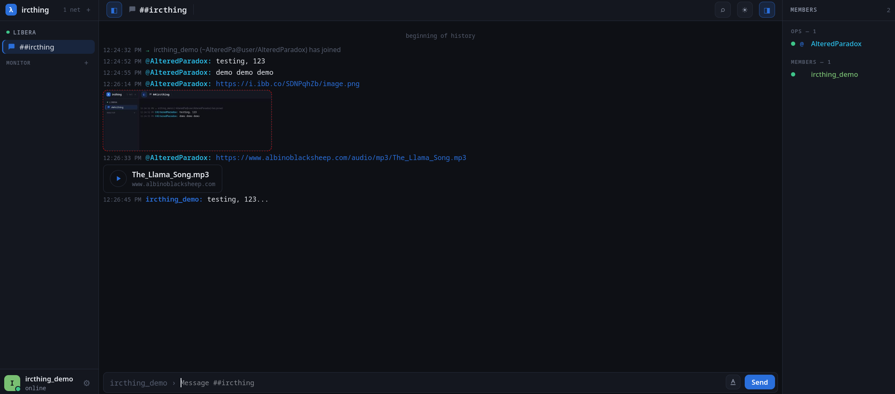
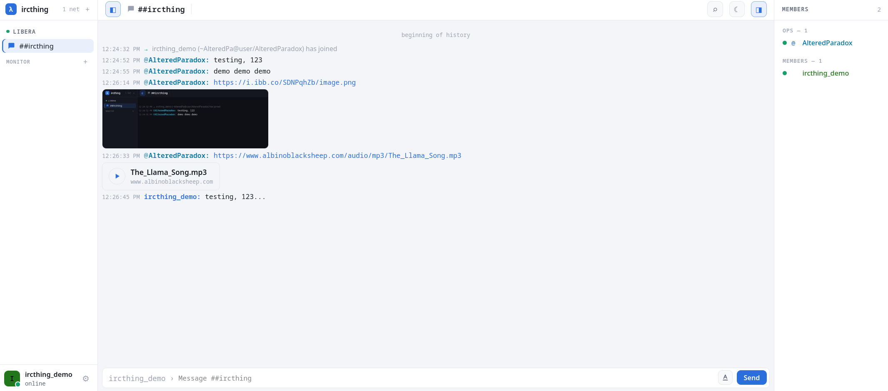
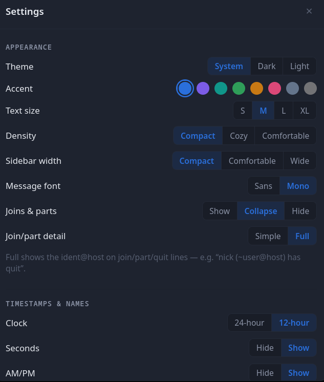

# ircthing

A self-hosted, always-connected web IRC client in a single static Go
binary. The binary contains the bouncer core — persistent IRC
connections, SQLite scrollback, multi-device read-marker sync — and
serves its own web frontend. Think "The Lounge, but one small binary":
you run one process, it stays on IRC, and every browser you log in from
picks up exactly where you left off.

No CGO, no runtime dependencies beyond the config file and the SQLite
database it creates. The binary is ~16 MB; the web bundle inside it is
~55 KB gzipped; a working setup with 5 networks and 10k messages of hot
scrollback runs in ~32 MB of RSS.





## Features

- **Bouncer core**: persistent connections with reconnect
  (exponential backoff + jitter), scrollback catch-up via `chathistory`
  with paginated backfill, and replay to every device. (Reconnect
  synchronization is best-effort under load: on a reconnect with very
  many channels the send queue can briefly saturate and silently drop a
  backfill round — logged, re-attempted on the next reconnect — and can
  likewise drop the `MARKREAD` read-marker fetches and the `MONITOR`
  buddy-list restoration issued at the same moment; read positions
  re-sync on the next reconnect or the next marker update, presence on
  the next reconnect.)
- **Protocol**: the full ratified IRCv3 set (SASL PLAIN /
  SCRAM-SHA-256 / EXTERNAL, `server-time`, `batch`, `echo-message`,
  `monitor`, STS with persisted policies, WHOX account discovery, bot
  mode, UTF8ONLY, ...) plus the modern drafts: `chathistory`,
  `read-marker`, `typing`, `multiline`, `message-redaction`,
  `no-implicit-names`. CTCP VERSION/PING/TIME/CLIENTINFO are answered;
  DCC is deliberately out of scope.
- **Connectivity**: TLS with client certificates, certificate
  fingerprint pinning for self-signed servers, and per-network egress —
  SOCKS5 (Tor-friendly: DNS resolves proxy-side), HTTP CONNECT, or an
  in-process userspace **WireGuard** tunnel (no TUN device, no root; DNS
  resolves in-tunnel so nothing leaks pre-tunnel except the peer endpoint's
  own hostname). Link previews for a WireGuard network are fetched through
  that same tunnel and fail closed if it's down.
- **Web UI**: virtualized message list (smooth at 50k+ messages),
  full-text search (FTS5), link previews, image thumbnails, and inline
  audio/video players — all through a server-side proxy, and nothing
  streams until you press play — a complete member list even on huge
  channels (cursor-paged from the server, windowed rendering), desktop
  notifications with per-network highlight rules, a MONITOR buddy list
  with live presence, typing indicators, and multiline composing with
  mIRC formatting and per-buffer input history. Closing a channel or PM
  keeps its history by default (the buffer returns, intact, on new
  activity or a rejoin); a settings toggle makes closing delete
  instead, behind a confirmation.
- **Multi-device**: read markers, unread counts, appearance
  preferences, highlight keywords, and ignore/mute lists sync through
  the server; `draft/read-marker` bridges read state to other bouncer
  clients. Deleting a rule or un-ignoring someone propagates too — a
  device that was asleep adopts the deletion instead of resurrecting
  its stale copy.
- **Web Push**: the server notifies your devices about highlights and
  private messages even with the app closed — including iOS home-screen
  PWAs (iOS 16.4+, delivered via APNs), where a backgrounded WebSocket
  cannot survive. A push waits ~20 s and is cancelled by anything that
  makes it moot: any device reading the buffer, muting it or ignoring
  the sender, closing the buffer, or the message being redacted (a
  deleted message never reaches a notification tray). Per-buffer
  coalescing keeps a busy channel to one notification, and tapping it
  opens the right conversation whether the app was open, suspended, or
  killed (best-effort in the last case: a rare window where the OS
  terminates the service worker mid-handoff can drop the target,
  landing you at your last buffer instead) — reopening the app also
  restores your last-viewed buffer, which iOS otherwise forgets.
  Payloads are end-to-end encrypted
  (RFC 8291), keys are provisioned automatically (no Apple/Google
  account or configuration needed), and enabling it is a per-device
  toggle in settings. Requires HTTPS (the reverse proxy you already
  have); on iOS, add the app to the Home Screen first. One deliberate
  metadata tradeoff: push delivery always uses the server's DIRECT
  egress, even for messages from networks configured with a
  SOCKS5/WireGuard proxy — payloads are end-to-end encrypted, but the
  push provider (Apple/Google/Mozilla) sees your server's IP and the
  notification timing. If that correlation matters for a network you
  tunnel, leave push off.
- **Theming**: dark/light/system, accent colors, text size, density,
  message font — plus a raw custom-CSS override. Usable at 360 px wide;
  installable as a PWA.

### Keyboard

| Keys | Action |
|---|---|
| `Ctrl+K` | channel switcher palette (mentions and unread float to the top) |
| `Ctrl+Shift+F` | full-text search |
| `Alt+↑` / `Alt+↓` | previous / next buffer |
| `Alt+Shift+↑` / `Alt+Shift+↓` | previous / next unread buffer |
| `Tab` / `Shift+Tab` | complete nicks, `/commands`, `:emoji:` — repeat to cycle |
| `Shift+Enter` | newline (sent as `draft/multiline` where supported) |
| `Ctrl+B` / `Ctrl+I` / `Ctrl+U` | bold / italic / underline (mIRC codes); `Alt+F` opens the full style + color panel |
| `↑` / `↓` | recall previously sent messages (from the draft's first/last line); `↓` while typing clears the box |

### Appearance

Theme, accent, text size, density, sidebar width, message font, and
join/part display are all live-editable:



## Quick start

Requires Go ≥ 1.25.12 (the `go.mod` toolchain floor — `make build` refuses an
older patch level, which would reintroduce fixed stdlib CVEs) and Node (for the
frontend build) — both build-time only.

```sh
make build                          # builds web assets + bin/ircd-web
./bin/ircd-web -hash-password       # type a login password (8–72 bytes), copy the hash
cp config.example.json config.json
chmod 600 config.json               # it holds the password hash + IRC/SASL/proxy secrets
$EDITOR config.json                 # set user, networks
./bin/ircd-web -config config.json
```

The config file holds credentials, so keep it `0600` (the systemd unit below
uses a root-owned credential instead).

The example config is written for a **proxy-fronted** deployment (loopback
listen, `"secure_cookies": true`, `"behind_proxy": true`). For this plain-HTTP
local test with **no** reverse proxy, flip both: set `"secure_cookies": false`
(a Secure cookie is never sent over `http://`, so login appears to succeed then
immediately bounces back — some browsers carve out `127.0.0.1`, Safari does
not) and `"behind_proxy": false` (with no proxy appending `X-Forwarded-For`,
trusting it would let anyone spoof the login rate-limit key). The binary warns
at startup if these disagree with the listen address.

Open http://127.0.0.1:8067 and log in with the user from the config.

## Configuration

`config.json` is strict JSON — unknown fields are errors, so typos fail
loudly. See `config.example.json` for a complete example.

| Field | Meaning |
|---|---|
| `listen` | HTTP listen address. Default `127.0.0.1:8067` (loopback only — see Deployment). |
| `database` | SQLite path, created on first run. Default `ircthing.db`. Created mode 0600 (it holds plaintext network credentials and message history); an existing group/world-readable file is tightened to 0600 on start. |
| `user.username`, `user.password_hash` | Web login. Generate the bcrypt hash with `ircd-web -hash-password`. |
| `session_ttl_days` | Login cookie lifetime. Default 30. |
| `ring_size` | Hot scrollback kept in memory per buffer. Default 200; older history is read from SQLite. |
| `retention_days` | Prune stored messages older than this many days. Default 0 (keep forever). Pruning runs hourly and keeps the search index in step; each hot buffer's in-memory ring is reconciled in the same pass, so pruned messages stop showing immediately. |
| `retention_max_messages` | Keep at most this many messages per buffer; older ones are pruned. Default 0 (unlimited). Retention is **per buffer**, not an aggregate disk cap: a server that opens many buffers can still grow the database. For production, put the database on a volume with a filesystem quota (or a dedicated volume) and monitor disk — the systemd unit bounds memory, not disk. Editable live in **Settings → History retention** (the stored value then wins over this seed). |
| `behind_proxy` | Set `true` when a **trusted single-hop** reverse proxy fronts the binary. The login rate-limit then keys on the **last `X-Forwarded-For` entry** (the hop the proxy appends) instead of the shared proxy address, so one attacker can't lock out everyone. The proxy **must** append the real client to `X-Forwarded-For` — Caddy's `reverse_proxy` does this by default; for nginx set `proxy_set_header X-Forwarded-For $proxy_add_x_forwarded_for;`. `X-Real-IP` is deliberately **ignored** (Caddy forwards a client-set `X-Real-IP` unchanged by default, so trusting it would let an attacker spoof the backoff key). Leave `false` for direct/loopback deployments — otherwise a client could spoof `X-Forwarded-For` to evade the backoff. It also lets the WebSocket origin check verify the request scheme via `X-Forwarded-Proto` (Caddy sends it by default; for nginx add `proxy_set_header X-Forwarded-Proto $scheme;`) rather than falling back to a host-only check; with it off behind a TLS-terminating proxy the check still permits the connection, just without the scheme assertion. |
| `disable_previews` | **Initial default** for the previews switch (tri-state). **Omit it and previews start OFF** — the privacy-first default, since an auto-fetched preview is a tracking beacon (a poster learns when a buffer is viewed) and the server makes **zero** outbound fetches. Set it to `false` to start with previews **on**, or `true` to be explicit about off. Toggle it live in **Settings → Link previews** (the saved value wins over this). Previews are fetched through **each link's own network proxy** — see [Preview fetches & the proxy SSRF caveat](#preview-fetches--the-proxy-ssrf-caveat). |

Networks are managed from the web UI: the **+** button in the sidebar
adds one; clicking a network's name offers *Join channel*, *Edit
network* (rename keeps the scrollback; saving reconnects), and — inside
the edit form — removal, which deletes the network's scrollback too.
Definitions live in the database; the config file's `networks[]` seeds
it on the **first run only** and is ignored once the table has rows, so
it can be left empty when starting fresh.

Per network (`networks[]` seed / edit form):

| Field | Meaning |
|---|---|
| `addr` | `host:port` of the IRC server. |
| `tls` | Use TLS. Plaintext requires the explicit `allow_plaintext: true` opt-in. |
| `trusted_fingerprints` | Hex SHA-256 pins of the server's certificate; a match replaces CA verification (self-signed servers). |
| `proxy` | `socks5://[user:pass@]host:port` (DNS resolves proxy-side) or `http://host:port` (CONNECT tunnel). Proxy auth is transmitted **in cleartext** (SOCKS5 username/password per RFC 1929, HTTP Basic), so only use credentialed proxies whose transport is itself encrypted or local/trusted (e.g. loopback, or inside a VPN tunnel). Mutually exclusive with `wireguard`. |
| `wireguard` | Egress this network through an in-process userspace WireGuard tunnel (no TUN device, no root) instead of a proxy — its Noise handshake authenticates without the cleartext exposure `proxy` auth has. Object with `private_key`, `peer_public_key`, `endpoint` (`host:port`; a hostname is resolved locally, pre-tunnel), `address` (this client's address inside the tunnel), `dns` (in-tunnel resolver, `ip` or `ip:port`, default `:53`), and optional `preshared_key` / `mtu` (default 1420). Keys are standard WireGuard base64 (as `wg genkey` / Mullvad print them). Target DNS resolves through the tunnel (no local leak). Link previews/thumbnails for links seen in a WireGuard network are fetched **through the same tunnel** (in-tunnel DNS, tunnel egress), so they inherit the network's IP — and fail closed (no preview) whenever the tunnel is down rather than ever fetching directly. Configurable in the web UI under **Egress → WireGuard tunnel**. Mutually exclusive with `proxy`. Endpoint resolution **prefers IPv4**: a dual-record (`A`+`AAAA`) endpoint whose IPv4 is unreachable fails to connect (it does not fall back to the `AAAA`, and never to direct egress — it fails closed, no leak). Pin the working family with an IP-literal `endpoint` if that bites. |
| `nick`, `username`, `realname` | Identity. `username`/`realname` default to the nick. |
| `pass` | Server password (`PASS`), rarely needed. |
| `sasl` | `mechanism` `""` picks automatically (EXTERNAL without a password, else SCRAM-SHA-256 when offered, else PLAIN). `cert_file`/`key_file` supply the client certificate for EXTERNAL; they may also be paired with PLAIN/SCRAM — the certificate is still presented during TLS, which is exactly what services CertFP (`CERT ADD`) needs while account auth stays password-based. SCRAM-SHA-256 does **not** apply SASLprep normalization to either the **login (account name) or the password** (RFC 5802 §2.2), so use ASCII (or already-normalized) values for both — a non-ASCII login or password may not match a server that normalizes it. |
| `channels` | Joined after every registration, so they come back on reconnect. The UI keeps this in sync: joining via the network menu adds to it, the *Leave channel* action removes. Note: because this client is the sole IRC connection, a **server- or services-forced** membership change (a `+f` channel forward, `SVSJOIN`/`SVSPART`) is treated as your intent and persisted here — so a forced join is rejoined after restart and a forced part is dropped. This is deliberate (it makes redirects survive restarts); it only matters against a compromised server or MITM on a plaintext connection, which can already force membership live. |

### Preview fetches & the proxy SSRF caveat

Link and image previews are fetched server-side, through the **egress of the
network the link came from** — a link in a proxied network is previewed over
that proxy, one in a **WireGuard** network is previewed through that tunnel
(in-tunnel DNS, tunnel egress), one in a direct network goes direct, and if
the link's network can't be resolved to a known egress the fetch is
**refused** rather than sent direct. A WireGuard preview also fails closed
(no preview) whenever the tunnel is down, so it never leaks your real IP. In
every case your egress IP matches the network's own. There is no separate
media proxy to configure.

Direct (unproxied) fetches are hardened: the *resolved* IP of every
connection and redirect hop is checked against a public-address policy at
connect time, which is rebinding-safe. This blocks private, loopback,
link-local, and the **well-known** NAT64 translation prefixes (RFC 6052/8215).
The one residual: a host with a **site-specific** NAT64 prefix (a custom NSP)
could translate a blocked IPv4 destination through that prefix — such prefixes
can't be enumerated statically. If you deploy on a NAT64 network with a custom
NSP, confirm the host has no such route, or leave previews off.

The one nuance is on the **proxied and WireGuard** paths: the proxy/tunnel
owns DNS (a WireGuard target resolves through the in-tunnel resolver), so the
server can only block *literal* private-IP targets — a hostname that resolves
*egress-side* to an internal address is reachable through the proxy/tunnel. A
WireGuard tunnel egresses to your WireGuard peer (typically a commercial VPN),
so it carries the same trust boundary as that provider's SOCKS5 below. Whether
this matters depends on **where the proxy/tunnel egresses**:

- **A commercial VPN's SOCKS5 (Mullvad, TorGuard, …), or Tor — low exposure,
  but the provider is a trust boundary.** The fetch egresses from the
  provider's network, not yours, so it cannot reach your LAN, loopback, or
  cloud metadata; those are exactly what the proxy shields. What remains
  reachable is the provider's own internal infrastructure — reputable
  providers isolate it, but you are trusting them to. (Tor also refuses
  private-IP destinations by exit policy.)
- **A SOCKS proxy on your own machine or LAN** (self-hosted `dante`,
  `ssh -D`, a local daemon) — **the case to watch.** There `127.0.0.1` and
  `192.168.x/10.x` resolve to *your* host/network, so a malicious preview
  link could probe internal services. Use a proxy whose egress you trust, or
  turn previews off (the previews switch in **Settings → Link previews** is
  global — there is no per-network preview toggle).

## Deployment

The listen address stays on loopback by design: put a TLS-terminating
reverse proxy (Caddy, nginx) in front for anything beyond localhost,
and set `"secure_cookies": true` (as in the example config) so the
session cookie is only ever sent over HTTPS — leave it `false` only for
plain-HTTP localhost testing, where a secure cookie would never be sent.
Also enable HSTS at the proxy (e.g. `Strict-Transport-Security:
max-age=63072000; includeSubDomains`) so browsers refuse to downgrade.
The proxy must **preserve the original `Host` header** — the CSRF/WebSocket
origin check compares it against the browser's `Origin`, so nginx's default
of passing the upstream address (`$proxy_host`) makes every login and
WebSocket attempt fail with 403; set `proxy_set_header Host $host;` (Caddy
preserves it automatically). WebSocket upgrade for `/api/ws` must be allowed
through the proxy too (Caddy: automatic; nginx: `proxy_http_version 1.1;`
plus `proxy_set_header Upgrade $http_upgrade; proxy_set_header Connection
"upgrade";` on that location). Rate-limiting `/api/login` at the proxy is
also recommended as defense-in-depth (the binary itself enforces a global
attempt-rate cap plus per-source backoff). Login attempts are logged to
stderr (the systemd journal) in a fail2ban-friendly form — a ready-made
filter and jail ship in [`deploy/fail2ban/`](deploy/fail2ban); see
[Banning brute-force sources](#banning-brute-force-sources-fail2ban) below.
The proxy must **forward the
`Origin` and `Sec-Fetch-Site` request headers unchanged** — the
state-changing/media endpoints use them as a CSRF defense and fail closed
without them (a proxy that strips both would make those endpoints refuse
every request).

A hardened systemd unit ships in [`deploy/ircthing.service`](deploy/ircthing.service).
It uses `DynamicUser=yes` — no service account to create — and hands the
config to the process as a systemd credential, so `/etc/ircthing/config.json`
stays root-owned and the app reads a private, service-only copy from
`$CREDENTIALS_DIRECTORY`. `StateDirectory=` creates `/var/lib/ircthing`
with the right ownership, so set `"database": "/var/lib/ircthing/ircthing.db"`.

If you use **SASL EXTERNAL** (client-certificate auth), the transient
`DynamicUser` account cannot read a root-owned `/etc/ircthing/*.pem` key.
Deliver the cert and key as additional systemd credentials — add
`LoadCredential=` lines for them and set the JSON values to the env-var form
`"cert_file": "$CREDENTIALS_DIRECTORY/client-cert.pem"` /
`"key_file": "$CREDENTIALS_DIRECTORY/client-key.pem"` (ircthing expands
`$VAR`/`${VAR}` in these two paths at load time) — or place them under the
service-owned `StateDirectory` with appropriate ownership. A world-readable
key is not an acceptable workaround.

```sh
sudo cp bin/ircd-web /usr/local/bin/
sudo mkdir -p /etc/ircthing && sudo cp config.json /etc/ircthing/
sudo chown root:root /etc/ircthing/config.json && sudo chmod 600 /etc/ircthing/config.json
sudo cp deploy/ircthing.service /etc/systemd/system/
sudo systemctl enable --now ircthing
```

The unit sets `GOMEMLIMIT=64MiB`, which keeps the Go heap comfortably
inside the project's 72 MB RSS target (`make memcheck` verifies the
5-networks / 50-channels / 10k-messages scenario: ~32 MB steady, and an
adversarial 16 KiB-message flood peaks transiently around 72 MB).

These RSS figures are for proxy/direct networks. Each **WireGuard** network
runs its own in-process gVisor netstack; one tunnel measured ~35 MB idle /
~58 MB peak under load on the 1 vCPU / 1 GB target (see `SPIKE.md`), so
**several** simultaneous WireGuard networks under `MemoryMax=128M` are
uncharacterized — budget headroom (or raise the limit) if you run more than
one or two.

### Docker

A turnkey **ircthing + Caddy** stack (automatic HTTPS, ircthing kept on a
private network) lives in [`deploy/docker/`](deploy/docker). A multi-stage
`Dockerfile` at the repo root builds the frontend, compiles the static
binary, and ships it on a minimal Alpine image (non-root, read-only root
filesystem, HTTP only — TLS terminates at Caddy).

**Follow the complete walkthrough in
[`deploy/docker/README.md`](deploy/docker/README.md)** — don't just copy the
examples and `up -d`. It covers generating the password hash, editing the
config *before* locking it to `0600`/uid 10001, and the IPv4-only
A-record-only (no AAAA) requirement. Skipping those can leave real
credentials in a world-readable file or advertise an unreachable address.

The container config sets `behind_proxy: true` (required — every request
arrives via Caddy). Prefer not to build? Each release publishes a multi-arch
image to `ghcr.io/alteredparadox/ircthing` (via
[`.github/workflows/docker-release.yml`](.github/workflows/docker-release.yml)) —
point the compose `image:` at it and drop the `build:` block. Because ircthing
runs in a container, fail2ban belongs on the **host** watching the container
journal, and its ban must target the `DOCKER-USER` chain to actually block
published ports.

### Banning brute-force sources (fail2ban)

ircthing logs every login outcome to stderr (captured by the systemd
journal under the unit above):

```
login: failed authentication from 203.0.113.7 (user "admin")
login: rate-limited from 203.0.113.7
login: authenticated from 198.51.100.4 (user "you")
```

The IP is the same address the login rate-limiter keys on, so **behind a
reverse proxy it is the real client** only when `behind_proxy` is `true`
and the proxy appends the client to `X-Forwarded-For` (see the config
table) — otherwise it is the proxy's own address and a ban would be
useless. The attempted username is `%q`-escaped, so a crafted value can't
forge or wrap a log line. A drop-in filter and jail live in
[`deploy/fail2ban/`](deploy/fail2ban):

```sh
sudo cp deploy/fail2ban/ircthing.conf /etc/fail2ban/filter.d/
sudo cp deploy/fail2ban/jail.local    /etc/fail2ban/jail.d/ircthing.conf
sudo systemctl reload fail2ban
```

The jail reads the journal (`backend = systemd`) and matches both the
failed-auth and rate-limited lines, so a source is banned whether it is
still guessing or already in the app's own backoff. Because the client
reaches ircthing *through* the proxy, the ban (an nftables/iptables rule
on the real client IP) blocks it at the box's firewall before the proxy —
which is exactly where the traffic enters.

## Development

```sh
make check        # vet, staticcheck, all tests, frontend build, size gates
make integration  # end-to-end against a real Ergo IRCd (built into .cache/)
make irctest      # irctest's client suite drives our CAP/SASL/TLS/STS handshake
make memcheck     # RSS scenario under GOMEMLIMIT=64MiB, asserted ≤ 72 MB
make build-debug  # unstripped, race-enabled binary for delve
```

Media-plane debugging: `IRCTHING_DEBUG_MEDIA=1` logs every
preview/thumbnail/stream fetch phase under an anonymized per-URL id and
returns the same id to the browser in an `X-Ircthing-Media-ID` response
header, so devtools and the server log correlate without URLs ever
entering persistent logs. `IRCTHING_DEBUG_MEDIA_URLS=1` (implies the
former) additionally logs the target URLs, with a loud startup warning.

Architecture, protocol scope, budgets, and working rules live in
[CLAUDE.md](CLAUDE.md). The short version: `internal/irc` speaks IRC
(one connection manager per network), `internal/store` owns SQLite,
`internal/hub` fans events out to WebSocket sessions, `internal/api`
is HTTP, and `web/` is a Preact frontend bundled by esbuild and
embedded into the binary. Hard budgets: 30 MB binary, 100 KB gzipped
bundle, 72 MB RSS.

## License

Copyright (C) 2026 AlteredParadox

This program is free software: you can redistribute it and/or modify it
under the terms of the GNU Affero General Public License as published by
the Free Software Foundation, either version 3 of the License, or (at
your option) any later version. See [LICENSE](LICENSE) for the full text.

This program is distributed in the hope that it will be useful, but
WITHOUT ANY WARRANTY; without even the implied warranty of
MERCHANTABILITY or FITNESS FOR A PARTICULAR PURPOSE. See the GNU Affero
General Public License for more details.

Because this is an AGPL network service, the running binary offers its
Corresponding Source to every user (AGPL §13): `/source` redirects to the
repository **pinned to the exact built commit** (from the `vcs.revision` the
Go toolchain stamps in), so a downstream fork that rebuilds points its users at
*its* source, not this one. The binary also serves its own license at
`/license` and the notices for every bundled dependency (Go modules linked into
the binary plus the embedded Preact frontend) at `/third-party-licenses`. All
three are unauthenticated so anyone using a deployment can reach them; the
Settings → About panel links them. **Downstream:** change `sourceBaseURL` in
`internal/api/api.go` to your fork before distributing binaries, and regenerate
the notices after any dependency change with
`scripts/gen-third-party-licenses.sh` (`make check` fails if they drift).
